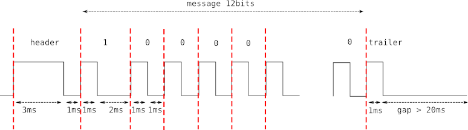

# Gonkyo

Gonkyo is small cli tool that allows you to control you onkyo amp or receiver  via RI interface and raspberry pi gpio.
Its written in pure golang using `cobra` and `go-rpio` library.

This project was inspired by [onkyo-rpi](https://github.com/ahaack/onkyo-rpi) project, but i wanted something statically compiled without extra dependencies. 

You can check onkyo-ri protocol description [here](http://fredboboss.free.fr/articles/onkyo_ri.php), but it goes something like this: 

There is also generic `signal` command that you can use to send any message to your amp.

# Usage
I have onkyo A-9150 stereo amp so i've created subcommands for that specific amp, but you can easily extend code to accommodate your use case.

# Setup
The connection to the RI interface is a simple 3.5 mm mono headphone jack. Connect the tip of the jack to a GPIO output pin (default gpio: 25, physical: 37) and the ground of the jack to a ground pin on your raspberry pi.